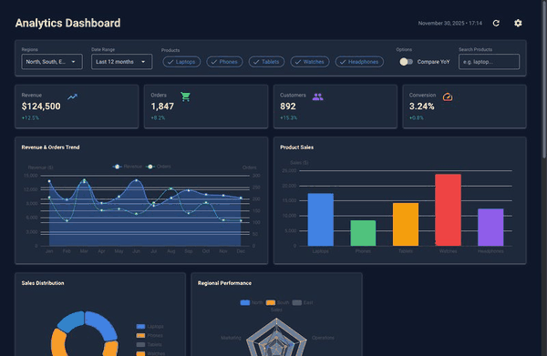

<p align="center">
  
</p>

<p align="center">
  <strong>Nice Vibes - Teach AI agents to build beautiful NiceGUI applications</strong>
</p>

<p align="center">
  <a href="https://www.python.org/downloads/"></a>
  <a href="https://nicegui.io/"></a>
  <a href="LICENSE"></a>
</p>

<p align="center">
  
</p>

A comprehensive toolkit of prompts, patterns, and examples that help AI coding assistants generate correct, idiomatic [NiceGUI](https://nicegui.io/) code.

## ✨ Features

- **📚 Complete Documentation** - Events, mechanics, styling, and class references
- **🔐 Authentication Patterns** - Signed cookie persistence, role-based permissions, login flows
- **🧭 SPA Navigation** - `ui.sub_pages`, header/drawer visibility, back button handling
- **🧪 Working Samples** - Full multi-dashboard app, stock analysis, custom components
- **🤖 AI-Optimized** - Single master prompt (~22K tokens) for context injection
- **✅ Validated** - All class references and URLs verified
- **🧩 Modular** - Pick what you need or use the full prompt

## 🚀 Quick Start

### Use Pre-Built Prompts (Recommended)

Just download and use the pre-built master prompt directly:

| Variant | Tokens | Use Case | Download |
|---------|--------|----------|----------|
| **Compact** | ~14K | Quick tasks, simple UI | [nice_vibes_compact.md](https://raw.githubusercontent.com/Alyxion/nice-vibes/refs/heads/main/output/nice_vibes_compact.md) |
| **Optimum** | ~23K | Most use cases | [nice_vibes.md](https://raw.githubusercontent.com/Alyxion/nice-vibes/refs/heads/main/output/nice_vibes.md) |
| **Extended** | ~34K | Custom components, deployment | [nice_vibes_extended.md](https://raw.githubusercontent.com/Alyxion/nice-vibes/refs/heads/main/output/nice_vibes_extended.md) |

Copy the content into your AI assistant's context or system prompt. When using tools such as Windsurf use Opus 4.5 as model and paste one of the URLs above to let it "teach itself" the principles of NiceGUI.

### Build From Source (Optional)

Only needed if you want to customize or extend the documentation:

```bash
git clone https://github.com/Alyxion/nice-vibes.git
cd nice-vibes
poetry install
poetry run python scripts/build_master_prompt.py
```

## 📋 Requirements

For building from source:
- Python 3.12+
- Poetry

## 📖 Documentation

| Folder | Description |
|--------|-------------|
| [docs/](docs/) | Main documentation |
| [docs/events/](docs/events/) | Event handling patterns |
| [docs/mechanics/](docs/mechanics/) | Core patterns (SPA, authentication, styling) |
| [docs/classes/](docs/classes/) | UI element reference by category |

## 📂 Other Folders

| Folder | Description |
|--------|-------------|
| [samples/](samples/) | Working example applications |
| [output/](output/) | Generated master prompts |
| [scripts/](scripts/) | Build and validation tools |
| [tests/](tests/) | Example NiceGUI tests |

## 🧪 Testing

```bash
poetry run pytest -v
```

## 🤖 Prompt Variants

Each variant is available in **online** (GitHub URLs) and **offline** (local paths) versions:

| Content | Compact | Optimum | Extended |
|---------|:-------:|:-------:|:--------:|
| Main guide | ✓ | ✓ | ✓ |
| Core mechanics | ✓ | ✓ | ✓ |
| Events | ref | ✓ | ✓ |
| Class reference | ref | ✓ | ✓ |
| Custom components | ref | ref | ✓ |
| Configuration & deployment | ref | ref | ✓ |
| Sample references | ✓ | ✓ | ✓ |

**ref** = Not included but referenced with summary (AI knows where to look)

Configure file order and summaries in `docs/prompt_config.yaml`.

## 🖥️ Command Line Interface

Nice Vibes includes a CLI to explore and run sample applications:

```bash
# Install the package
pip install nice-vibes

# Interactive sample selector
nice-vibes

# List available samples
nice-vibes list

# Run a sample
nice-vibes run dashboard

# Copy sample source code to current directory
nice-vibes copy dashboard
nice-vibes copy video_custom_component -o my_video_app
```

<p align="center">
  
</p>

## 🔌 MCP Server (Optional)

NiceVibes includes an optional [Model Context Protocol](https://modelcontextprotocol.io/) server that gives AI assistants dynamic access to:

- **Guided project creation** - Step-by-step questionnaire with best practices
- **Documentation search** - Find topics without loading everything into context
- **Source code inspection** - Read NiceGUI component source directly
- **Visual debugging** - Capture screenshots of running or newly created applications
- **Sample exploration** - Browse and copy working examples

Get your configuration with `nice-vibes mcp-config`:

```json
{
  "mcpServers": {
    "nice-vibes": {
      "command": "/path/to/python",
      "args": ["-m", "nice_vibes.mcp"]
    }
  }
}
```

Add this to your MCP client config ([Windsurf](https://www.windsurf.com/), [Claude Desktop](https://claude.ai/desktop), etc.).

This is how it works:

<p align="center">
  
</p>

See [nice_vibes/mcp/README.md](nice_vibes/mcp/README.md/) for detailed setup instructions.

## 🙏 Credits

Created by **Michael Ikemann**

[](https://github.com/Alyxion)
[](https://www.linkedin.com/in/michael-ikemann/)

Built for use with [NiceGUI](https://nicegui.io/) - a Python UI framework by [Zauberzeug](https://github.com/zauberzeug/nicegui).

## 📄 License

This project is licensed under the MIT License - see the [LICENSE](LICENSE) file for details.

Free to use, modify, and distribute.
