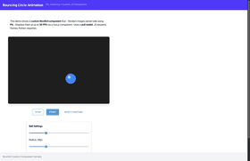

# Bouncing Circle Animation
<!-- animated -->



A sample demonstrating custom JavaScript/Vue components with Python-side rendering using PIL.

## Features

- **Custom NiceGUI Component**: `AnimatedImage` wraps a Vue.js component that displays images at high frame rates
- **Server-Side Rendering**: Images are rendered in Python using PIL (Pillow)
- **Pull-Based Frame Requests**: JavaScript requests frames when ready, Python responds with base64-encoded PNGs
- **Up to 30 FPS**: Smooth animation with automatic frame rate adaptation
- **Per-User State**: Each browser tab gets its own bouncing ball via `app.storage.client`

## Architecture

```
┌─────────────────────────────────────────────────────────────┐
│                        Browser (JS)                         │
│  ┌─────────────────────────────────────────────────────┐   │
│  │              animated_image.js (Vue)                 │   │
│  │  1. Request frame ──────────────────────────────►   │   │
│  │  4. Display image ◄──────────────────────────────   │   │
│  │  5. Image loaded → goto 1                           │   │
│  └─────────────────────────────────────────────────────┘   │
└─────────────────────────────────────────────────────────────┘
                              │ ▲
                              │ │
                    WebSocket │ │ WebSocket
                              │ │
                              ▼ │
┌─────────────────────────────────────────────────────────────┐
│                       Server (Python)                       │
│  ┌─────────────────────────────────────────────────────┐   │
│  │            animated_image.py (NiceGUI)               │   │
│  │  2. Handle 'frame-request' event                     │   │
│  │  3. Call render callback, send base64 PNG           │   │
│  └─────────────────────────────────────────────────────┘   │
│  ┌─────────────────────────────────────────────────────┐   │
│  │                  main.py (PIL)                       │   │
│  │  render_frame(): Update ball position, draw circle  │   │
│  └─────────────────────────────────────────────────────┘   │
└─────────────────────────────────────────────────────────────┘
```

## Files

| File | Description |
|------|-------------|
| `main.py` | Application entry point, ball physics, PIL rendering |
| `animated_image.py` | Python component class extending `Element` |
| `animated_image.js` | Vue component for frame display and requests |

## Running

```bash
cd samples/bouncing_circle
python main.py
```

Then open http://localhost:8080 in your browser.

## Key Patterns Demonstrated

### Custom Component Definition

```python
class AnimatedImage(Element, component='animated_image.js'):
    def __init__(self, width: int = 400, ...):
        super().__init__()
        self._props['width'] = width
        self.on('frame-request', self._handle_frame_request)
```

### Event-Driven Communication

```javascript
// JS requests frame
this.$emit('frame-request');

// Python handles and responds
def _handle_frame_request(self, _e):
    frame_data = self._frame_callback()
    self.run_method('updateFrame', base64_data)
```

### PIL Rendering

```python
img = Image.new('RGB', (width, height), color=(30, 30, 30))
draw = ImageDraw.Draw(img)
draw.ellipse([x1, y1, x2, y2], fill=color)
buffer = BytesIO()
img.save(buffer, format='PNG')
return buffer.getvalue()
```

## Requirements

- nicegui
- Pillow (PIL)
